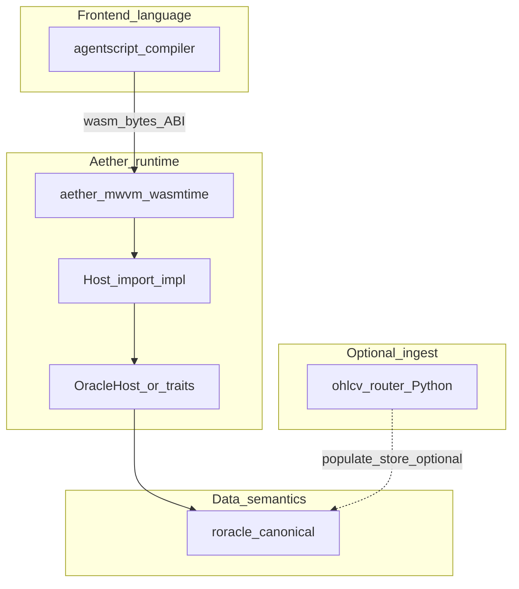

# Data backend and oracle stack — development guide

This document is the **architecture and integration guide** for how **Aether** connects **untrusted guest WASM** (from `agentscript-compiler`) to **market and fundamental data**. It complements [`agentscript-guest-abi.md`](agentscript-guest-abi.md) (import/export contract) and the compiler’s [`docs/aether-integration-gap.md`](../../agentscript-compiler/docs/aether-integration-gap.md).

---

## 1. Goals

| Goal | Implication |
|------|-------------|
| **Reproducible jobs** | Backtests pin **bytecode** (`wasm_sha256`) and **data identity** (e.g. commitment / snapshot id). The oracle layer must answer reads **deterministically** for a given pin. |
| **Safe execution** | User strategy code runs in **WASM** with **host imports only**; no arbitrary network or filesystem from the guest. |
| **Maintainable MVP** | Prefer **one orchestrated path** and **one canonical semantics layer** over merging unrelated tools into a single codebase. |
| **Evolvable contracts** | Compiler defines **what** the guest may call (names, signatures, order). Aether + oracle define **what those calls mean** and **how** values are produced. |

---

## 2. Layer model (who owns what)

| Layer | Repository / location | Responsibility |
|-------|----------------------|------------------|
| **Language → WASM** | `agentscript-compiler` | Parse, analyze, lower to HIR, emit `wasm32` with stable **`aether`** imports (see compiler `codegen/wasm/abi.rs`). **No** oracle policy, **no** roracle dependency. |
| **Sandbox + linker** | `aether-mwvm`, future engine | Instantiate WASM, enforce **fuel / memory limits**, **register** host functions for each import. |
| **Host import bodies** | Aether (Rust) | Bridge: read guest linear memory for string args, call into **traits**, write results as `f64` / side effects (`plot`, etc.). |
| **Data semantics (canonical)** | **roracle** (intended) | Symbol resolution, timeframe alignment, **MTF / `request.security` merge**, **financial** series, currency, `na` policy as product rules. **Single source of truth** for “what the data means.” |
| **OHLCV multi-provider fetch** | `aether/ohlcv-router` (Python) | **Optional**: async candles from many public APIs, cache, CLI. **Not** the canonical oracle for strategy semantics. |

---

## 3. Unifying the stack (what “one stack” means)

**Recommended interpretation for MVP:** unify on **one job pipeline** and **one data API behind the host**, not on **one monolithic repository or process**.

### 3.1 Do unify

- **Contract:** Guest ABI version + import table documented next to compiler emission ([`agentscript-guest-abi.md`](agentscript-guest-abi.md), compiler `GUEST_ABI_V0_IMPORTS`).
- **Orchestration:** A single “run job” path: load WASM → verify hash → instantiate → (eventually) call `init` / `step` in a loop with **one** injected oracle implementation.
- **Semantics:** One backend answers all **series** and **`request.*`** reads for that job (roracle or a **fixture** implementing the same trait surface).

### 3.2 Do not unify (for MVP efficiency)

- **Do not** expand `ohlcv-router` until it “covers everything roracle covers.” That creates **two** semantic layers (Python vs product oracle) and **drift**.
- **Do not** require the compiler to depend on roracle or Aether; keep **build-time** and **run-time** separable.
- **Do not** embed ad hoc HTTP calls inside the guest; all data crosses **host imports** only.

---

## 4. `ohlcv-router` vs roracle

| Dimension | `ohlcv-router` (under `aether/ohlcv-router`) | roracle (product oracle) |
|-----------|-----------------------------------------------|---------------------------|
| **Primary shape** | Python package; **OHLCV candle** fetch from many providers | Intended **system of record** for symbols, series, fundamentals, job-level data identity |
| **Best use** | Research, **bulk ingest**, demos that need quick candles | **Backtest and production** reads; implements semantics for **`request.security`** / **`request.financial`** / chart series |
| **Runtime coupling** | **Weak**: subprocess, sidecar, or batch job feeding storage | **Strong**: in-process Rust trait or internal service behind Aether |
| **MVP recommendation** | **Off the hot path** unless you need it to **fill** datasets roracle will serve | **On the hot path** as the **canonical** implementation (or a **trait + in-memory fixture** with the same API until roracle ships) |

**Rule of thumb:** roracle (or its stand-in) **defines** truth; `ohlcv-router` **may supply raw OHLCV** into that world, but must not **redefine** merge rules, symbology, or financial id semantics.

---

## 5. Security and trust boundaries

| Concern | Approach |
|---------|----------|
| **Untrusted code** | WASM only; **no** `unsafe` escape from guest logic beyond explicit imports. |
| **Host surface area** | Only **documented** `aether::*` imports; each mapped to a small Rust shim that delegates to **audited** trait methods. |
| **Data exfiltration** | Guest cannot open sockets; host decides what each import returns from **pinned** or **job-scoped** datasets. |
| **Supply chain** | Pin **`wasm_sha256`** (and later toolchain metadata if needed). Compiler output is an **opaque blob** verified before load. |
| **Python ingest** | `ohlcv-router` runs **outside** the WASM sandbox; treat API keys and network policy there separately from the strategy runner. |

Treating **layers with explicit boundaries** is **not** weaker security than a monolith—it makes **review and testing** easier because each side has a **narrow interface**.

---

## 6. Suggested Aether structure (evolutionary)

This is a **target shape**; exact crate names can follow your workspace layout.

1. **`aether-common` (or sibling)**  
   - Traits such as `StrategyDataHost` / `OracleSession`: methods for `series_close(bar)`, `request_security(...)`, `request_financial(...)`, plot sinks, etc., parameterized by **bar index** and **job context**.  
   - Keeps **MWVM** and **backtester** from depending on roracle types directly if you prefer a thin boundary.

2. **`aether-mwvm` (or `aether-strategy-runner`)**  
   - Today: `link_aether_guest_abi_v0` with **stubs** for CI / preflight.  
   - Next: `link_aether_guest_abi_v0_with_host(&mut linker, host: Arc<dyn StrategyDataHost>)` (or per-store callbacks) that **replace** stubs for real runs.

3. **roracle adapter crate** (optional package name)  
   - `impl StrategyDataHost for RoracleAdapter` — the only place roracle-specific types and IO live.

4. **Fixtures** (`aether-mwvm` tests or `aether-testdata`)  
   - `impl StrategyDataHost for DeterministicFixture` — fixed OHLCV + one security + one financial series for **contract tests** without roracle or network.

5. **`ohlcv-router`**  
   - Remains **documentation + optional tooling** under Aether (or moved to a `tools/` repo). Document how its output can **feed** roracle or cold storage; do not register it as the default host for WASM imports unless you accept Python in the critical path.

---

## 7. MVP development sequence (recommended)

1. **Freeze guest ABI slice** you intend to support (already largely defined for v0; see [`agentscript-guest-abi.md`](agentscript-guest-abi.md)).  
2. **Define `StrategyDataHost` (or equivalent)** in Rust with signatures matching **`aether` imports** (including string pointers/lengths from guest memory).  
3. **Implement `DeterministicFixture`** and wire **non-stub** linker path in a test: compile tiny indicator → instantiate → call **`step`** (once `step` arguments are defined).  
4. **Implement roracle-backed adapter** behind the same trait; swap fixture for roracle in integration tests.  
5. **Extend imports** only when compiler and ABI doc are updated together (see compiler `wasm/abi.rs` and [`tests/wasmtime_guest_instantiate.rs`](../../agentscript-compiler/crates/agentscript-compiler/tests/wasmtime_guest_instantiate.rs) stub parity).  
6. **Use `ohlcv-router`** only if you need **additional candle sources** for ingest; keep it **outside** the default strategy execution loop until operational requirements demand it.

---

## 8. Operational concerns

| Topic | Guidance |
|-------|----------|
| **Determinism** | Same job pin + same oracle snapshot → same results; document FP and `na` rules in roracle / host docs. |
| **Latency** | Prefetch / static request graph (compiler metadata) is **optional**; start with **on-demand** host calls for MVP. |
| **Cross-repo CI** | Compiler emits WASM; Aether tests load bytes or pinned fixtures. Full **aether-mwvm** ↔ **agentscript-compiler** dev-dependency may fail on some toolchains; duplicated stub tables in compiler integration tests are an acceptable bridge (see compiler integration-gap doc). |
| **Docs ownership** | **Imports / indices:** compiler + [`agentscript-guest-abi.md`](agentscript-guest-abi.md). **Behavior of reads:** this doc + roracle + Aether runner docs. |

---

## 9. Related documents

| Document | Role |
|----------|------|
| [`agentscript-guest-abi.md`](agentscript-guest-abi.md) | Guest WASM imports/exports contract |
| [`agentscript-compiler` integration gap](../../agentscript-compiler/docs/aether-integration-gap.md) | Compiler ↔ Aether checklist |
| [`agentscript-compiler` ROADMAP](../../agentscript-compiler/ROADMAP.md) | Language and codegen phases |
| `aether/ohlcv-router/README.md` | Scope of Python OHLCV tooling (ingest, not oracle policy) |

---

## 10. Summary

- **Canonical data semantics** belong in **roracle** (or a trait-compatible **fixture** during early MVP).  
- **Aether** owns **sandbox, linker, and host shims** that implement the **`aether`** WASM imports by calling that trait.  
- **`agentscript-compiler`** owns **language and bytecode** only.  
- **`ohlcv-router`** is **optional OHLCV ingest**, not a second oracle.  
- **Unify** on **one pipeline and one trait-backed oracle**, not on collapsing every tool into one layer—**better security, faster MVP, clearer ownership.**
